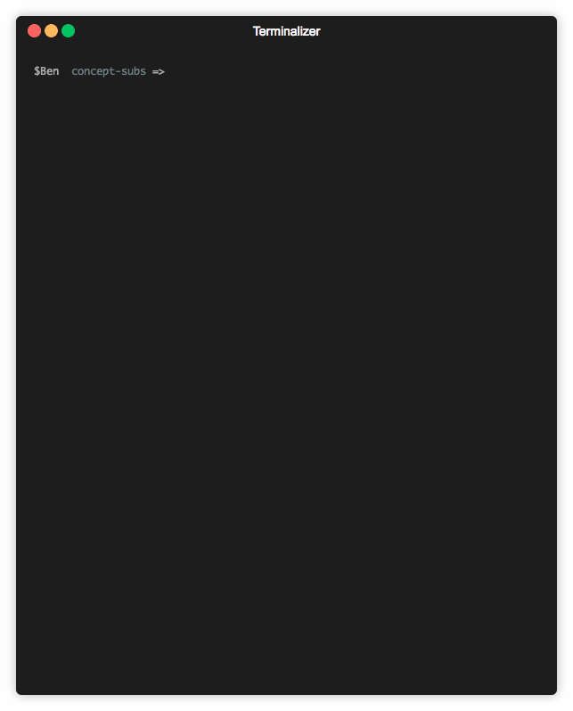

# QR Codes For Local Development



Need to test your site on a device?

Stop typing out IP addresses and jump into the future with QR Codes!

## Getting Started

Install it!
```sh
npm install webpack-dev-server-qr-code
```

Note: You must be using the `devServer` options inside of your webpack config for this to work!

In your Webpack config, add this line:

```js
const WebpackQRCodePlugin = require('webpack-dev-server-qr-code');

module.exports = {
  /** This option must be present in your config */
  devServer: {
    /** port MUST be specified */
    port: 9000,

    /** Your 'host' value must be '0.0.0.0' for this to work */
    host: '0.0.0.0'
  },
  /* ... */
  plugins: [
    /** your plugins */
    new WebpackQRCodePlugin()
    /** your other plugins */
  ]
};

```

Boom! You're finished!

The plugin will print a QR code to your terminal when you first run the app, with your `local IP`.

Make sure your mobile device is on the same network as your computer, and you should be set!

Enjoy!

